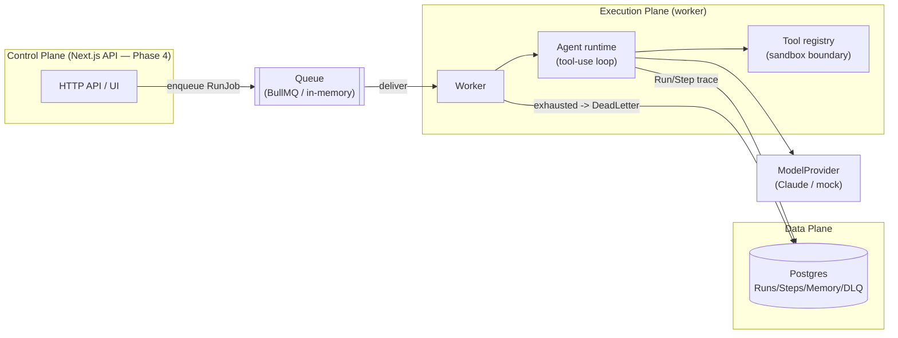
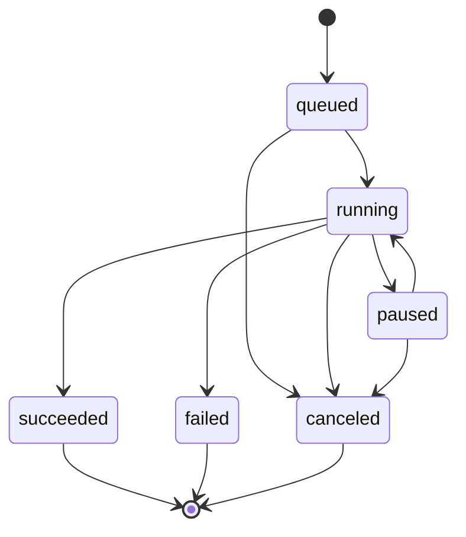
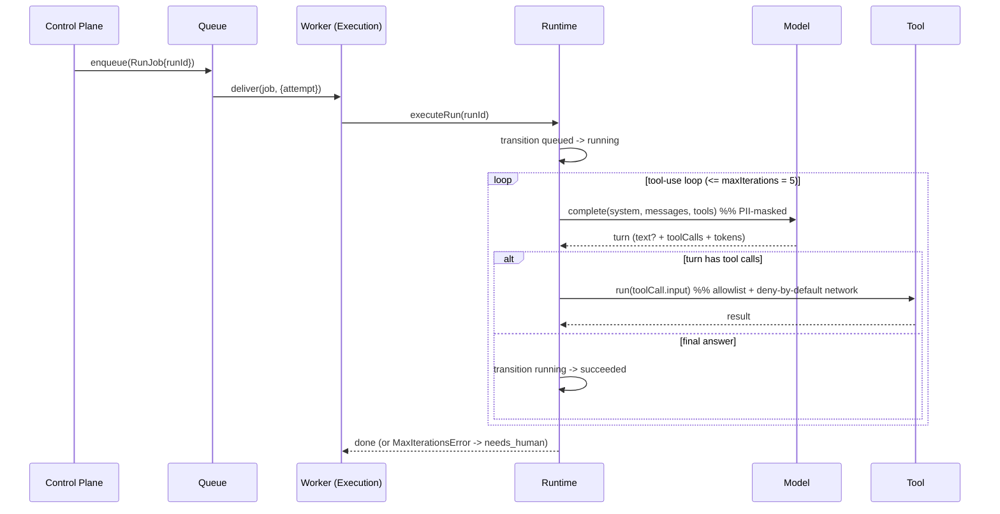
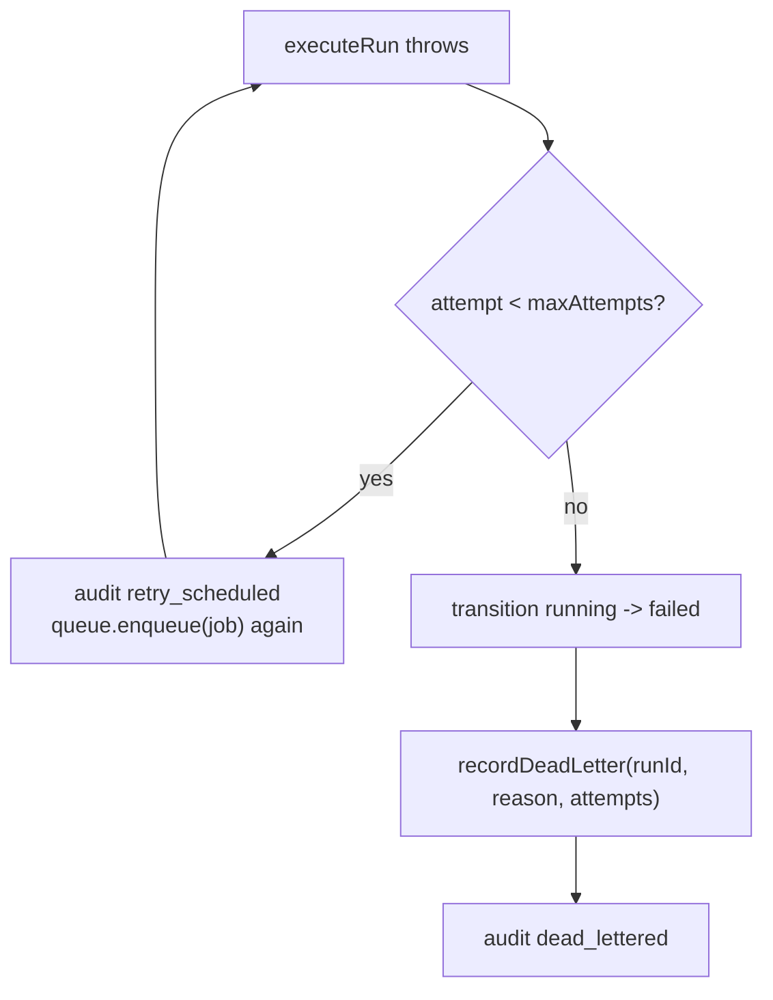
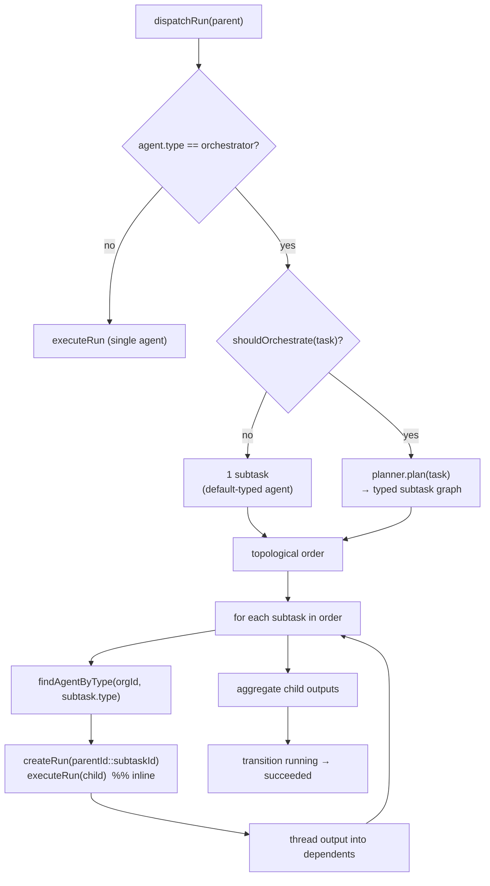
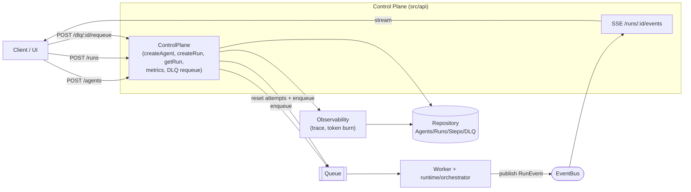

# agent-os — Architecture blueprint

Diagrams render on GitHub (Mermaid). See `SPEC.md` for the prose specification.
This is an internal tool — no billing/credits; token usage is a per-step metric only.

## 1. Three planes

The runtime depends only on the **ports** (`Queue`, `Repository`, `ModelProvider`); adapters are
chosen in `src/index.ts`. That boundary is what keeps the planes from drifting.

## 2. Run state machine

All status changes flow through `transition()`; illegal edges throw `IllegalTransitionError`.

## 3. Run execution sequence (happy path)

## 4. Failure / retry / DLQ

Idempotency note: step ids are deterministic `(runId, index)`, so re-executing a Run on retry
upserts the same step rows (no duplicate trace).

## 5. Auto-orchestration (F6)

The worker dispatches by agent type: `orchestrator` runs go to the orchestrator, everything else
to the single-agent runtime.

Child run ids are deterministic (`parentId::subtaskId`). On an orchestration retry, completed
children are terminal and skipped (idempotent); only unfinished subtasks re-run.
In production (post-F4) the inline `executeRun(child)` becomes an async `queue.enqueue(child)`
coordinated by the event bus.

## 6. Control Plane + events (F4)

