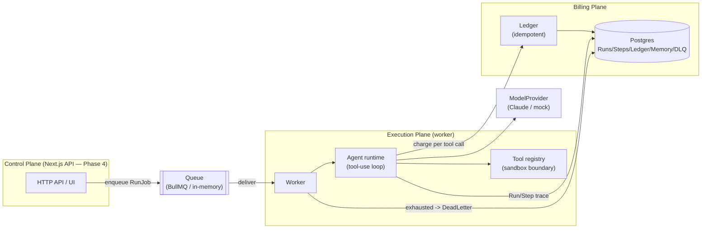
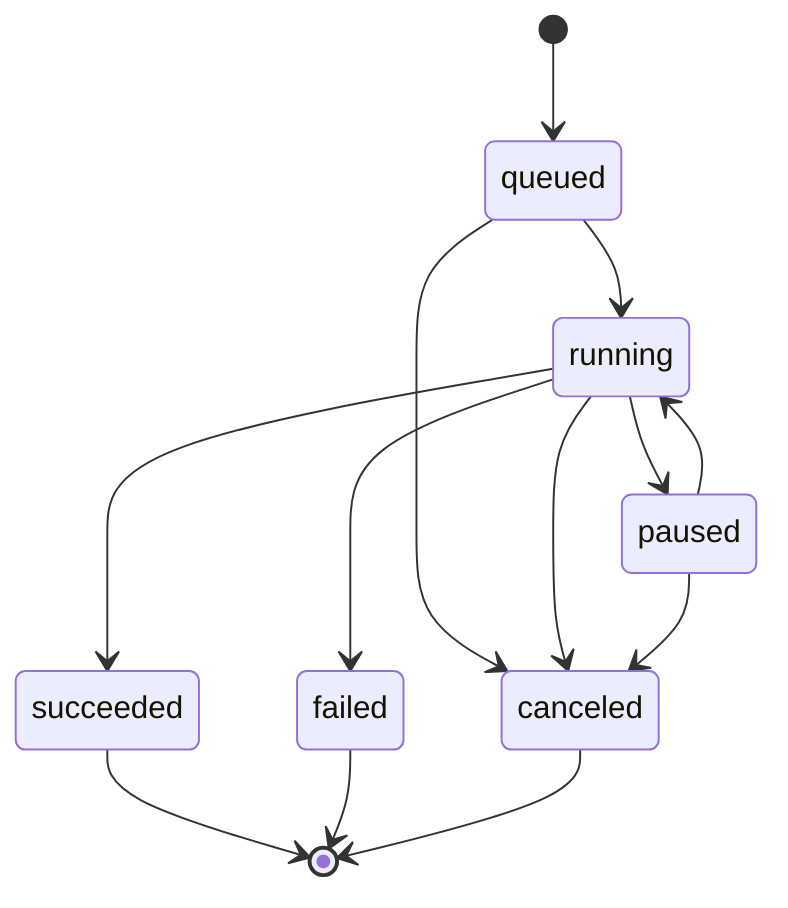
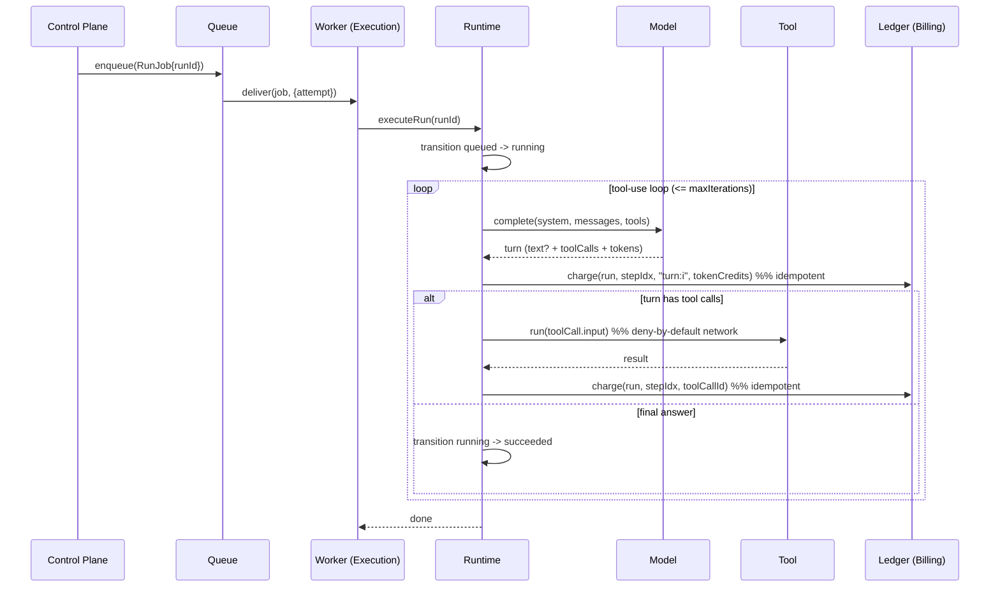
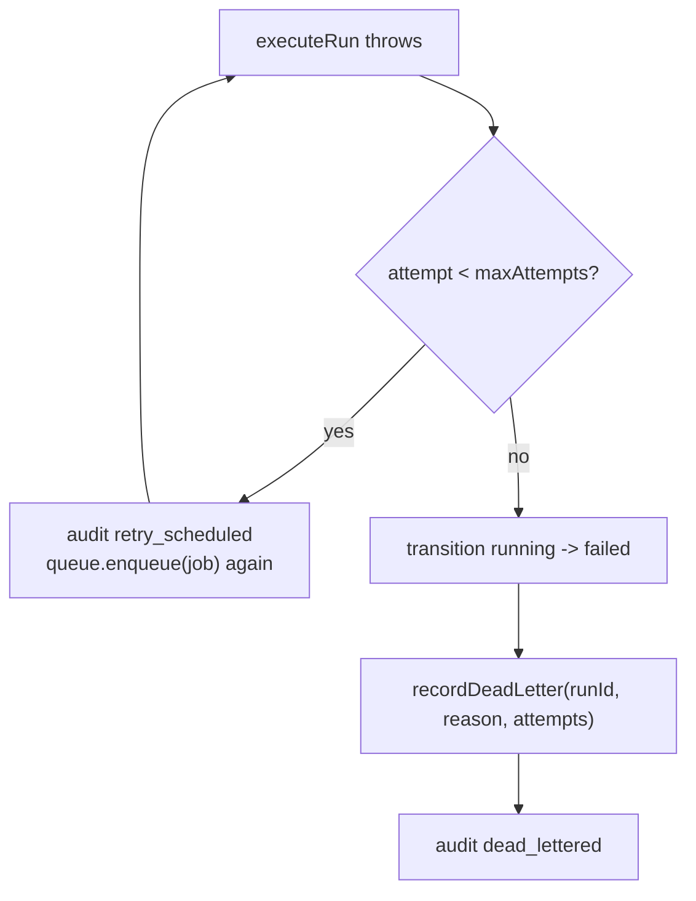
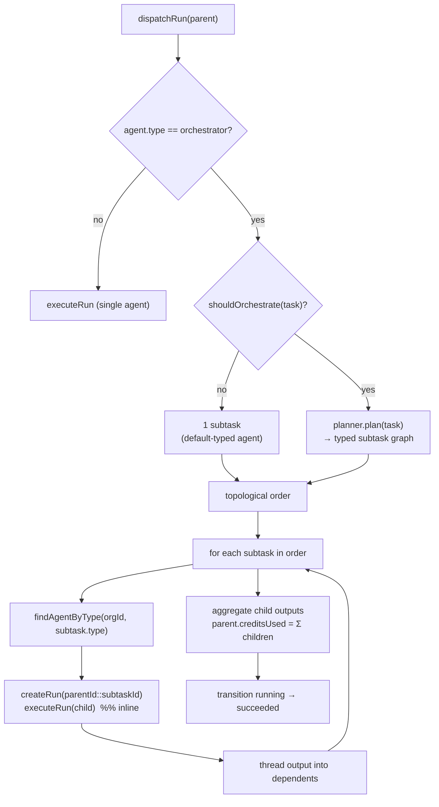
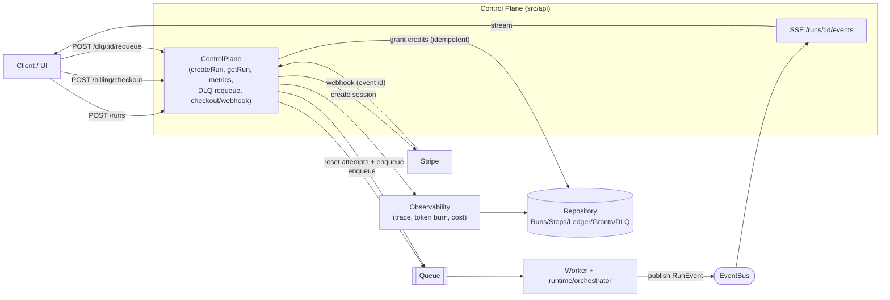

# agent-os — Architecture blueprint

Diagrams render on GitHub (Mermaid). See `SPEC.md` for the prose specification.

## 1. Three planes

The runtime depends only on the **ports** (`Queue`, `Repository`, `ModelProvider`); adapters are
chosen in `src/index.ts`. That boundary is what keeps the planes from drifting.

## 2. Run state machine

All status changes flow through `transition()`; illegal edges throw `IllegalTransitionError`.

## 3. Run execution sequence (happy path + billing)

## 4. Failure / retry / DLQ

Idempotency note: because step indices and tool-call ids are deterministic, re-executing a Run on
retry re-charges the **same** `(runId, stepIndex, toolCallId)` keys, which the ledger collapses to
a single charge — so retries never double-bill.

## 5. Auto-orchestration (F6)

The worker dispatches by agent type: `orchestrator` runs go to the orchestrator, everything else
to the single-agent runtime.

Child run ids are deterministic (`parentId::subtaskId`). On an orchestration retry, completed
children are terminal and skipped (idempotent, no re-billing); only unfinished subtasks re-run.
In production (post-F4) the inline `executeRun(child)` becomes an async `queue.enqueue(child)`
coordinated by the event bus.

## 6. Control Plane + events + billing (F4)

Billing idempotency: a Stripe `checkout.session.completed` webhook is applied via a `CreditGrant`
unique on `(source, externalId)`, so a redelivered event credits the org exactly once.
